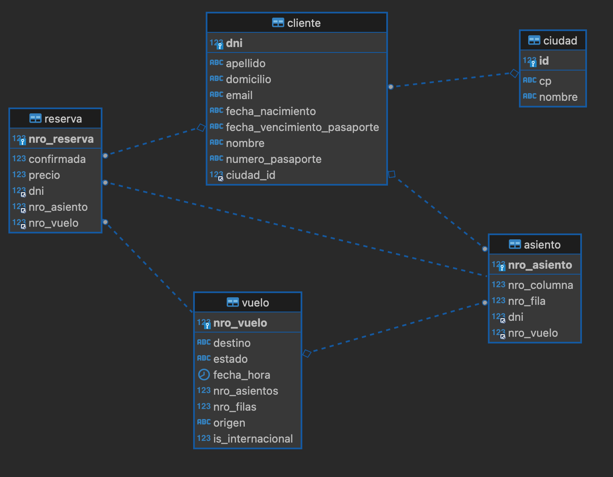

# Diseño de Aplicaciones Orientadas a Servicios
## Tecnicatura Universitaria en Tecnologías de Información
### Universidad Tecnológica Nacional

## Prof. Dardo Javier Kuttel

## Integrantes:

- María Sofía Fregona
- Pablo Navarro
- Diego Maldini Freyre

## Aportes rama Diego Maldini Freyre
Modifiqué la estructura -para orientarme mejor- basándome en la estructura moderna
de Spring Framework / Domain Driven

Y este es el ERD actual:

